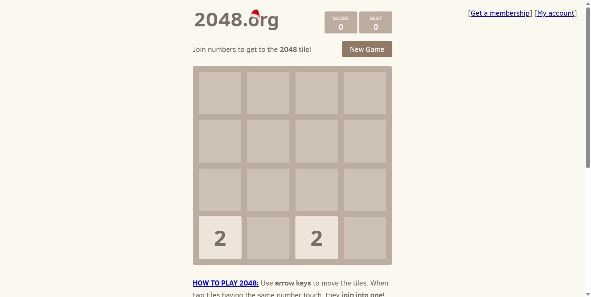

# 2048
项目简述
----

使用前端技术，构建一个“2048”小游戏，游戏规则如下：

```text-plain
1、游戏棋盘由4*4共16个小格子组成，每个小格子可以存放一个数字方块。
2、玩家每次操作可以选择上下左右其中一个方向去滑动，每滑动一次，所有的数字方块都会往滑动的方向靠拢，系统也会在空白的地方乱数出现一个数字方块，3、两个相同数字的方块在靠拢、相撞时会相加，变成一个相加后的数字方块；若有多个相同数字方块相撞，系统判断顺序从滑动方向的最边侧方块开始。
4、系统给予的数字方块不是2就是4，玩家要想办法在这小小的16格范围中凑出“2048”这个数字方块。
```

立项背景
----

检验自己的前端知识学习掌握程度。

项目原型
----



来源[2048 Game](https://www.2048.org/)

使用技术
----

HTML+CSS+JS